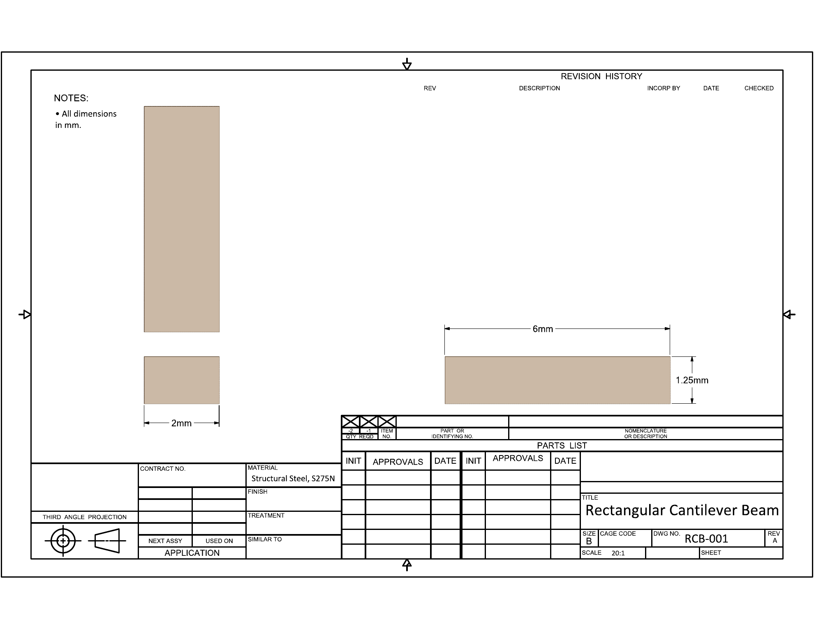
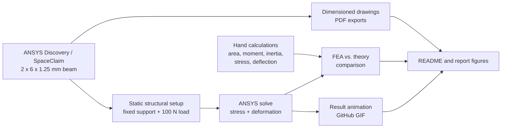
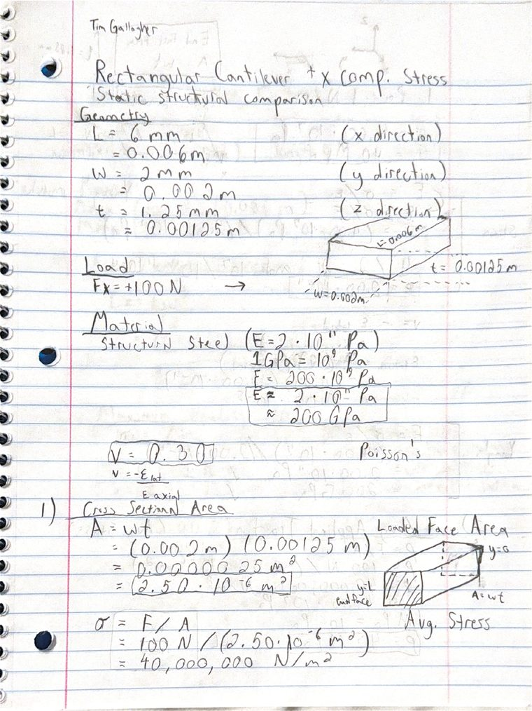
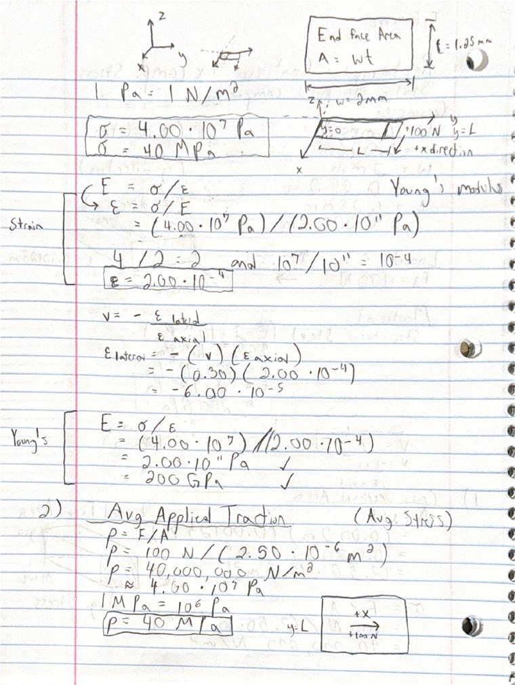
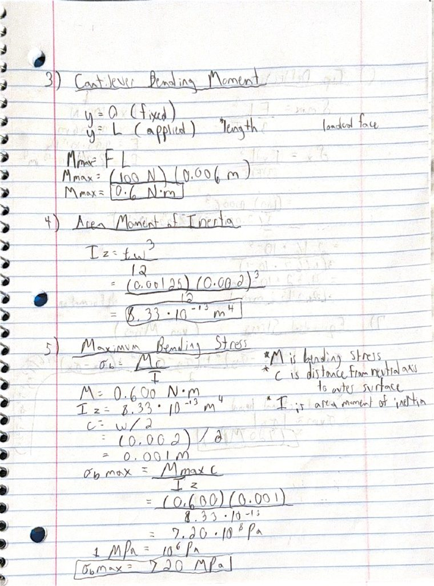
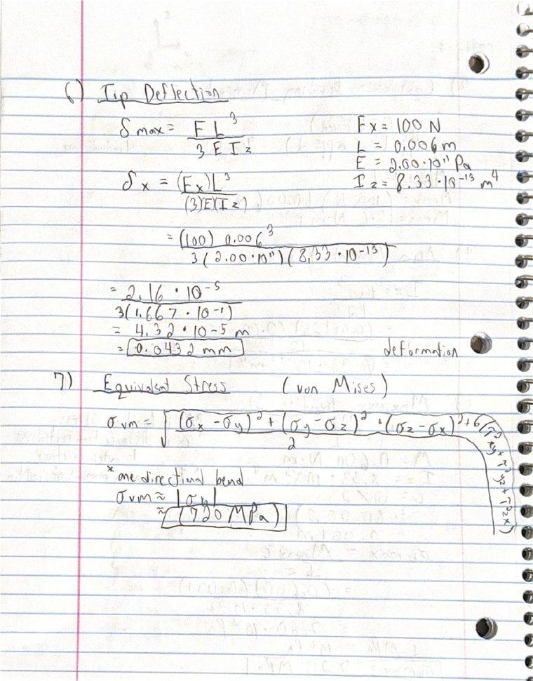

# Design and Implementation of a Rectangular FEA Stress Simulation

An end-to-end mechanics project for modeling, hand-checking, and visualizing a rectangular cantilever beam under static load. The repository includes dimensioned SpaceClaim drawings, ANSYS static-structural result media, LaTeX calculation notes, and report-ready figures for a small structural-steel beam.

This project was inspired by [Zein Zreik's 3-DOF parallel robot project](https://github.com/ZeinZreik/Design-and-Implementation-of-a-3-DOF-Parallel-Robot), but the engineering focus here is finite-element stress validation rather than robot kinematics and control.

[](Structural%20Analysis/Results/rectangle_cube_animation.gif)

<p align="center">
  <a href="Design/Drawings/rectangular_beam_spaceclaim.pdf"></a>
  <a href="Design/Drawings/rectangular_beam_dimensions.pdf"></a>
  <a href="Functional%20Analysis/Calculations/rectangular_beam_calculations.pdf"></a>
</p>

## Problem

Small structural parts can show stress concentrations that simple beam theory does not fully capture. This project uses a controlled rectangular cantilever-beam case to compare first-principles mechanics calculations against ANSYS finite-element results for stress and deformation.

## My Role

The work covers the complete analysis path:

- Geometry setup and dimension verification for a 2 mm x 6 mm x 1.25 mm beam
- SpaceClaim drawing creation with clean engineering dimensions
- ANSYS static-structural setup with structural steel, S275N
- Fixed-support and applied-force boundary conditions
- Stress/deformation result visualization and GitHub-previewable animation export
- Hand calculations for traction, bending moment, section inertia, bending stress, deflection, and von Mises comparison
- LaTeX calculation PDF and organized engineering repository structure

## Design and Implementation

The model is a rectangular structural-steel cantilever beam. One end face is fixed, and a 100 N load is applied to the opposite end face in the +X direction. The beam is intentionally simple so the FEA result can be checked against mechanics-of-materials formulas instead of treated as a black-box simulation.

The implementation connects three parts:

- Design: dimensioned beam geometry and drawing exports
- Functional analysis: beam-theory calculations and unit-consistent formulas
- Structural analysis: ANSYS static-structural result artifacts and comparison values

## System Architecture



## Project Snapshot

- Domain: finite-element analysis, mechanics of materials, structural validation
- Model: rectangular cantilever beam
- Dimensions: 2 mm x 6 mm x 1.25 mm
- Material: structural steel, S275N
- Boundary condition: fixed support on one end face
- Load case: 100 N applied in the +X direction on the free-end face
- Analytical model: cantilever beam bending and tip-deflection check
- Simulation output: equivalent stress and total deformation
- Documentation: drawings, calculation PDF, result animation, README/report figures

## Engineering Scope

- Measured and documented the beam geometry in SpaceClaim.
- Created clean 2D and 3D dimensioned drawing exports.
- Built a simple but traceable ANSYS static-structural load case.
- Derived the relevant beam formulas from cross-sectional area through stress and deflection.
- Compared hand estimates against ANSYS result values.
- Exported result media in a GitHub-viewable format.
- Organized the repository around engineering deliverables instead of generic file buckets.

## Repository Map

```text
Design/
  Drawings/                         Dimensioned SpaceClaim and drawing PDFs
Functional Analysis/
  calculation_notes.md              GitHub-readable formula notes
  Calculations/                     LaTeX source and rendered calculation PDF
Structural Analysis/
  Results/                          ANSYS stress/deformation animation GIF
Programming/
  README.md                         Reserved for scripts or automation if added later
Report/
  Figures/                          README/report preview images
README.md                           Main project overview and navigation
```

## Functional Analysis

The calculation starts from the beam dimensions and builds up to stress and deflection:

$$
A = wt
$$

$$
p = \frac{F}{A}
$$

$$
M_{max} = FL
$$

$$
I_z = \frac{tw^3}{12}
$$

$$
\sigma_{b,max} = \frac{M_{max}c}{I_z}
$$

$$
\delta_{max} = \frac{FL^3}{3EI_z}
$$

ANSYS reports equivalent stress using the von Mises stress definition. For this mostly bending-dominated case, the hand estimate uses bending stress as the first comparison value, then checks the FEA stress increase caused by the fixed-support stress concentration.

Key files:

- [Calculation PDF](Functional%20Analysis/Calculations/rectangular_beam_calculations.pdf)
- [LaTeX source](Functional%20Analysis/Calculations/rectangular_beam_calculations.tex)
- [Handwritten calculation scan](Functional%20Analysis/Calculations/rectangular_beam_handwritten_calculations.pdf)
- [Markdown calculation notes](Functional%20Analysis/calculation_notes.md)

### Handwritten Notes Preview

Click any page to open the full handwritten scan.

<p align="center">
  <a href="Functional%20Analysis/Calculations/rectangular_beam_handwritten_calculations.pdf"></a>
  <a href="Functional%20Analysis/Calculations/rectangular_beam_handwritten_calculations.pdf"></a>
  <a href="Functional%20Analysis/Calculations/rectangular_beam_handwritten_calculations.pdf"></a>
  <a href="Functional%20Analysis/Calculations/rectangular_beam_handwritten_calculations.pdf"></a>
</p>

## Structural Analysis

The ANSYS model validates the same beam under the same load case used in the hand calculation. The result of interest is not just whether the beam bends, but how closely the FEA stress and displacement compare with the simple cantilever estimate.

| Quantity | Hand estimate | ANSYS result |
| --- | ---: | ---: |
| Maximum equivalent stress | 720 MPa | 861.3 MPa |
| Estimated stress bound | 720 MPa | 917.7 MPa |
| Maximum deformation | 0.0432 mm | 0.0475 mm |

The ANSYS stress is higher than the simple beam-theory estimate because the fixed support creates a local 3D stress concentration. The deformation comparison is closer because global cantilever stiffness is captured reasonably well by the hand calculation.

Key file:

- [Stress animation GIF](Structural%20Analysis/Results/rectangle_cube_animation.gif)

## Final Deliverables

- Dimensioned 3D beam view PDF
- Dimensioned engineering drawing PDF
- LaTeX calculation PDF with formulas and comparison values
- Handwritten calculation scan used as supporting work
- GitHub-previewable stress/deformation animation
- Organized engineering repository with design, analysis, structural results, programming placeholder, and report figures

## How to Explore

- Start with [Functional Analysis/Calculations/rectangular_beam_calculations.pdf](Functional%20Analysis/Calculations/rectangular_beam_calculations.pdf) for the math build-up.
- Use [Design/Drawings/rectangular_beam_spaceclaim.pdf](Design/Drawings/rectangular_beam_spaceclaim.pdf) for the 3D dimensioned model view.
- Use [Design/Drawings/rectangular_beam_dimensions.pdf](Design/Drawings/rectangular_beam_dimensions.pdf) for the drawing-sheet dimensions.
- Use [Structural Analysis/Results/rectangle_cube_animation.gif](Structural%20Analysis/Results/rectangle_cube_animation.gif) for the result animation.
