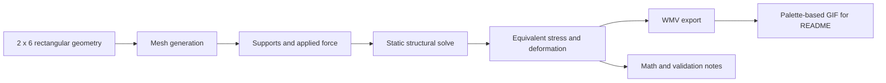

# Rectangular FEA Stress Simulation

A compact finite-element analysis project for modeling stress and deformation in a rectangular component under applied loading. This repository is being set up to document the ANSYS workflow, result exports, supporting math, and presentation-ready media as the project develops.

## Problem

Rectangular structures under load develop nonuniform stress and displacement fields. This project uses a simple 2 x 6 rectangular geometry as a controlled model for learning and documenting static structural analysis, including geometry setup, meshing, boundary conditions, equivalent stress review, and result export.

## My Role

The current work covers the setup path:

- Creating the rectangular geometry and opening it in the ANSYS workflow
- Generating the mesh and preparing a static structural analysis
- Applying supports and force loading
- Solving and reviewing equivalent stress and deformation results
- Exporting ANSYS animations for GitHub-readable documentation
- Building out the math, assumptions, and validation notes as the project matures

## Analysis Workflow



## Project Snapshot

- Domain: finite element analysis, mechanics, biomedical engineering foundations
- Model: rectangular geometry under static loading
- Primary tool: ANSYS Workbench / Discovery / Mechanical
- Primary result: equivalent stress and deformation visualization
- Media workflow: export high-quality WMV from ANSYS, then convert to a GitHub-previewable GIF
- Status: initial repository scaffold; detailed math and final result artifacts will be added next

## Repository Map

```text
assets/       README media, result images, and final GIF exports
docs/         math derivations, assumptions, and process notes
simulation/   curated ANSYS setup notes, project files, and result exports
```

## Media Export Notes

GitHub previews GIFs directly in the README, while WMV files usually require download. The current plan is to export the cleaner animation from ANSYS as WMV, then convert it with FFmpeg using a generated palette:

```powershell
ffmpeg -i bend.wmv -vf "fps=30,scale=1000:-1:flags=lanczos,palettegen" palette.png
ffmpeg -i bend.wmv -i palette.png -lavfi "fps=30,scale=1000:-1:flags=lanczos[x];[x][1:v]paletteuse=dither=sierra2_4a" -loop 0 assets/rectangle-stress.gif
```

## Next Work

- Add final geometry dimensions, material properties, supports, and force magnitude
- Add the hand calculations and assumptions used to interpret the simulation
- Add the best stress/deformation screenshots and README animation
- Decide which ANSYS source files are small and useful enough to track

## Reference

This repository layout is inspired by Zein Zreik's 3-DOF parallel robot project README structure, but the engineering content here is a separate rectangular stress simulation project.
