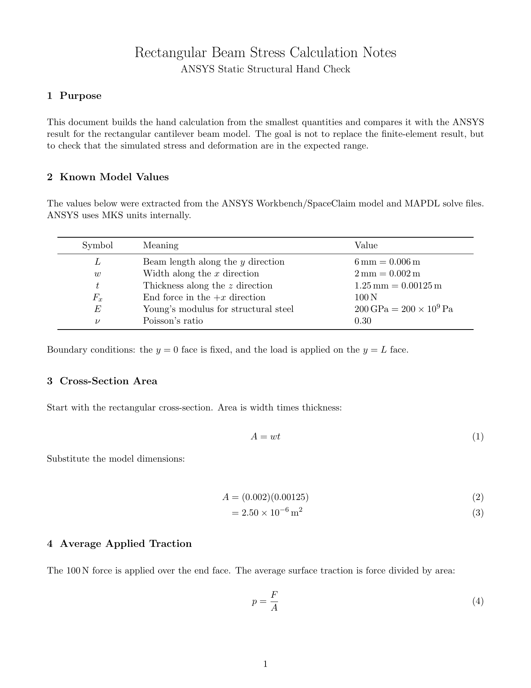
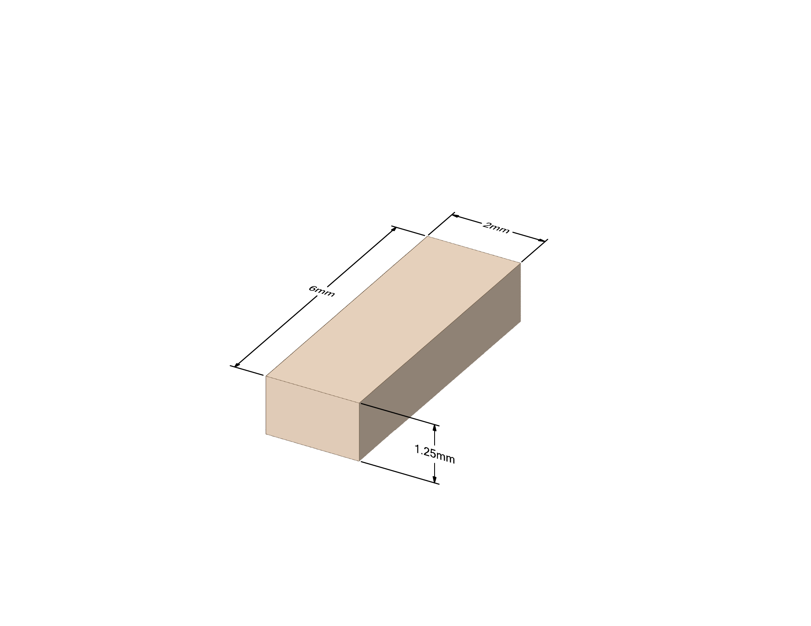

# Rectangular FEA Stress Simulation

Small ANSYS finite-element project showing stress and deformation in a 2 mm x 6 mm x 1.25 mm rectangular beam under a 100 N static end load. The project was inspired by Zein Zreik's 3-DOF parallel robot project, but this is a separate FEA study.

[](rectangle_cube_animation.gif)

## Project

- Geometry: rectangular cantilever beam, fixed at one end
- Material: structural steel
- Load: 100 N in the +X direction on the free-end face
- Result focus: equivalent stress and total deformation
- Math notes: [docs/math.md](docs/math.md)
- Calculation PDF: [docs/rectangular_beam_calculations.pdf](docs/rectangular_beam_calculations.pdf)
- Animation: [rectangle_cube_animation.gif](rectangle_cube_animation.gif)

## Calculations

[](docs/rectangular_beam_calculations.pdf)

The calculation document starts from units and geometry, then builds through area, applied traction, bending moment, section inertia, bending stress, deflection, von Mises stress, and ANSYS comparison.

- [Calculation PDF](docs/rectangular_beam_calculations.pdf)
- [LaTeX source](docs/rectangular_beam_calculations.tex)

## Dimensions

[](docs/rectangular_beam_spaceclaim.pdf)

[3D dimensioned view PDF](docs/rectangular_beam_spaceclaim.pdf)

[](docs/rectangular_beam_dimensions.pdf)

[Dimensioned drawing PDF](docs/rectangular_beam_dimensions.pdf)

## Files

```text
rectangle_cube_animation.gif             click-to-preview simulation animation
assets/rectangular_beam_calculations.png  first-page calculation preview
assets/rectangular_beam_spaceclaim.png    3D dimensioned beam preview
assets/rectangular_beam_dimensions.png    drawing sheet preview
docs/math.md                            formula summary for GitHub reading
docs/rectangular_beam_calculations.tex   LaTeX calculation source
docs/rectangular_beam_calculations.pdf   full calculation PDF
docs/rectangular_beam_spaceclaim.pdf     3D dimensioned beam PDF
docs/rectangular_beam_dimensions.pdf     dimensioned drawing PDF
simulation/                             curated ANSYS setup notes and reproducibility files
```

## Next

- Add final stress/deformation screenshots or plots only if they clarify the result
- Decide whether any small ANSYS setup files should be included for reproducibility
